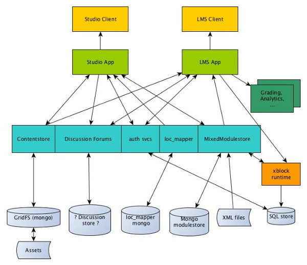
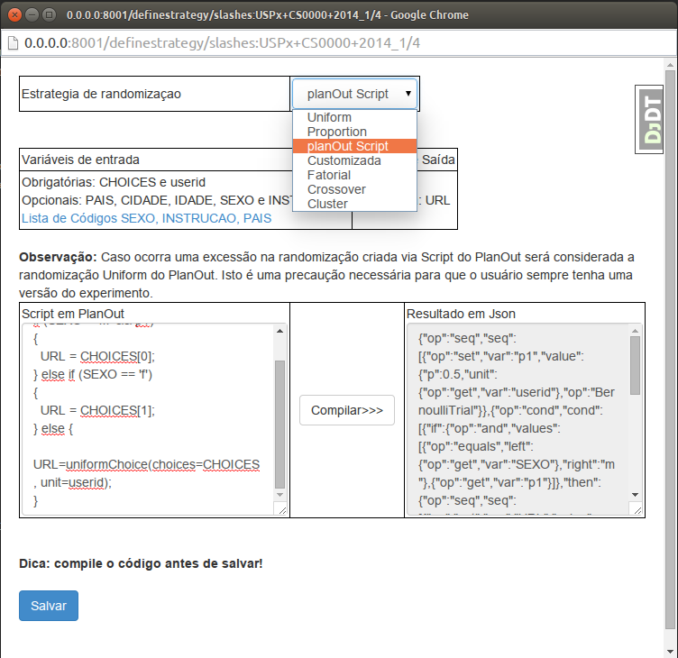

# "It is a capital mistake to theorize before you have all the evidence": Educational trial design, randomization and analysis framework integrated into an Open Source Learning Management System

<!-- documentation to be translated
https://github.com/geekaia/edx-platform/tree/master/common/djangoapps/experiments
https://github.com/geekaia/edx-platform/tree/master/common/djangoapps/experimentslms
https://github.com/geekaia/edx-platform/tree/master/cms/templates/experiment

 -->

Jacinto José Franco, MSc
Joao Ricardo Vissoci, PhD
Bruno Melo
Jacson Barros
Ricardo Pietrobon, MD, PhD
Seiji Isotani, PhD

## Abstract

<!-- write at the end -->

## Introduction

Despite Sherlock Holmes' widely known advice that theorizing before having data will bias the judgment <!-- Doyle, A Study in Scarlet (1887), Part 1, chap. 3, p. 27 -->, the history of education until recently can be largely summarized as a massive theorization followed by widespread education policy implementation, all of that occurring with no or minimal experimental validation. <!-- ref -->While observational data are now somewhat more prevalent in the educational literature, and randomized studies are slowly becoming more common, it is unfortunate that experiments are still largely divorced from the daily educational practice. 

In the now classic [Pyramid of Evidence](http://libguides.mssm.edu/hierarchy) proposed by the founders of Evidence-Based-Medicine, randomized controled trials and the corresponding meta-analyses are at the top, while observational studies and reports based on personal experience are positioned at a lower level. While this classification has been transposed to educational research <!-- ref -->, it has also been significantly criticized since randomized controled trials tend to select samples that are consistently different from the population where its results are supposed to be applied. <!-- ref --> While the same is certainly true for in person education - individuals commiting to participate in an in-person educational trial will likely be different - in online environments randomization can be seamless, with the potential to conduct dozens of experiments within a single educational unit. An example of platforms allowing for online randomization include the [Planout framework](https://facebook.github.io/planout/), recently released by [Facebook](https://www.facebook.com/) and currently used to conduct over 1000 experiments on their site. Despite the promising perspective of transforming education into an evidence-driven field, to date most learning management systems have been unable to take advantage of frameworks such as Planout, and as a consequence the number and quality of educational trials is still far behind where it could be.

When it comes to randomized experiments in education, a full range of designs is theoretically possible. For example, cluster randomized trials have been advocated when a class might be highly influenced by an instructor <!-- ref -->, factorial trial have been advocated when simultaneously testing variations of an educational method <!-- ref -->, blocked and stratified designs when there might be concern regarding imbalances. More recent and sophisticated designs, such as N-of-1 and bandit randomization can also have their place in education in situations where, respectively, outcomes without a carryover effect is studied or when the efficacy of a given intervention might vary across different contexts. <!-- ref --> All of these designs are certainly interesting, but without a supporting technology they are more often than not relegated to a secondary plane, educators often not making use of randomization at all or using simplistic designs when more sophisticated ones could lead toward better information to guide educational practice.

In face of these gaps, the objective of this study is therefore to describe the integration of the fully validated Planout framework for the design of online randomized trials with the Open edX Learning Management System. Specifically, we provide details about its architecture along with taxonomy to guide educators regarding the match across specific educational designs, educational studies where they would bring advantages, and a description of how they can be implemented under our framework. 

## Methods
### edX and PlanOut descriptions

The [Open edX platform](http://code.edx.org/) is an open source, Python-based learning management system licensed under the AGPL <!-- ref -->license. Student data are stored on a relational databases ([MySQL]()) and course metadata stored within a NoSQL document database ([MongoDB]()). It is based on a very modular architecture and built with the assistance of a strong, international open source community. It currently contains a number of modules allowing for its expansion, the main building block being an [XBlock]() learning component. In addition to XBlocks, the Open edX platform currently contains additional modules such as the edX-ORA (Open Response Assessor), which allows for self, peer and automatic grading of open questions. Although an initial effort to create a randomization mechanism for AB trials (randomized experiments comparing arm A versus B), this system is currently limited to the comparison of theme changes, and is thus primarily focused on the testing of User eXperience (UX) features. The randomization of full educational methods and content is therefore still limited.

When organizing courses, instructors are presented with the edX Studio Content Management System, which allows them to set a hierarchical course structure containing sections, subsections and unities. Unities can then contain videos, exercises, texts, among other forms of educational content. 

[Planout](https://facebook.github.io/planout/) was recently released by [Facebook](https://www.facebook.com/) as an open source, Python-based framework for conducting online randomized experiments. With designs being easily configurable using [JSON (JavaScript Object Notation)](), Planout allows for the design of an extensive range of configuration for designs such as clustering, blocking, stratification, different allocation proportions, indefinite number of randomization arms, among many others. Given its easy extensability, Planout allows not only for the implementation of a multitude of different designs, but also for the creation of new designs that might not have been described in the trial literature thus far.

### Existing randomization within Open edX

<!-- Jacinto, voce pode descrever o sistema atual aqui? -->

### Requisites and informal use cases

Our primary requisites for the system were: (1) the system should be able to randomize anything included within the Open edX platform, not restricting itself to User eXperience features but also including any type of educational content, (2) it should be able to deliver a wide range of design and randomization frameworks such as the ones offered through Planout, (3) it should allow for external scripting, thus facilitating its further integration with future frameworks such as those offering visual feedback to exercise groups and (4) it should provide researchers with ability to extract the data for research and quality improvement studies. Notice that as a first release we have did not stipulate a reporting graphical interface as a requisite.

Our primary informal use case is described as:

1. The educational researcher creates the control arm on a course within Open edX
1. The educational researcher clones the control arm to create the intervention arm
2. The educational researcher selects a script from a Planout library to match the design she wants to implement, modifying it to match local requirements
3. The script is inserted on the Open edX interface
4. The trial is tested

### Application architecture

Below we describe the original Open edX and PlanOut architectures, followed by the overall integration architecture.

#### Original Open edX
Open edX's architecture is based on a group of modular components, including Studio (a Content Management System), Learning Management System, Comment Service in addition to the mysql and MongoDB CITE [OpenEdX Components](http://openedxdev.wordpress.com/openedx/architecture/openedx-architecture/). This architectural modularity allows for <!-- Jacinto, não está claro --> across different hosts, ultimately making the architecture highly scalable. This architecture can therefore improve response times, even with a high hit rate.

<!--OLHE AQUI O edX é composto por um conjunto de componentes modulares, dentre os principais, podemos citar: Studio/CMS (a Content Management System), Learning Management System (LMS), Comment Service (cs\_comments\_service), ORA (Open Response Assessor) e mais os bancos de dados Mysql e MongoDb CITE[OpenEdX Components](http://openedxdev.wordpress.com/openedx/architecture/openedx-architecture/). Esta modularidade da arquitetura permite que alguns serviços possam ser executadas em hosts distintos, tornando a arquitetura altamente escalável, melhorando os tempos de resposta, mesmo quando a taxa de acessos é grande. Há também a possibilidade de se adicionar nós redundantes e, combinar isso com um Load Balancer para aumentar a disponibilidade dos serviços. -->

Figure XXX demonstrates the main elements in this architecture, containing the CMS and LMS. The CMS provides a group of tools for the authoring of courses. It also allows for the addition of items such as the pass and fail criteria, settings for learner activity and content import and export. The CMS also makes available resources such as videos, HTML pages, problems and forum discussions.

The LMS contains a number of methods that allows for learners to enroll in courses, interact with content made available through the CMS. LMS also allows course staff to extract learner data from each course. 

The majority of the components in the Open edX platform are based on the Django framework, and the content is rendered using the Mako library, allowing for better flexibility and performance. Além de Python, do lado do servidor também utiliza-se Java, Ruby, Ruby on Rails, e NodeJs. Do lado cliente, obviamente, o conteúdo é renderizado utilizando-se HTML, JavaScript, CSS e SASS.

#### Original PlanOut

[PlanOut](https://facebook.github.io/planout/) allows for the design and deployment of randomized experiments evaluating the impact of a group of interventions on a specific set of outcomes. Released under a [BSD or  Berkeley Software Distribution License](https://github.com/facebook/planOut/blob/master/LICENSE), PlanOut allows for these designs to be created in two different ways: Python classes or [JSON (JavaScript Object Notation)](http://json.org/) files generated from the compilation of PlanOut scripts. The PlanOut scripting language provides logical operators, matrices and flow control. 

Among the operators made available through PlanOut for randomization, in our project we made use of the following:

1. UniformChoice: all arms have the same probability of being selected
2. WeightedChoice: allows for the specification of a probability for each arm
3. BernoulliTrial: returns a value of 0 or 1 according to a pre-specified probably distribution

Each randomization design is independent and each operation uses hash functions in addition to pseudo-random number generators. After the randomization schedule is generated, the framework creates an entry in a .log file, which will contain all arguments used as input, the time stamp, a user identification and the options defined for that specific randomization design.

#### Integration architecture

Figure X displays and a partial Entity Relationship Diagram for our software. These entities are defined in a [MySQL]() database and described in some Python classes.

In order to create the integration between Open edX and PlanOut, and make possible to load designs created by third-party software. We have added the following entities: <!-- modifiquei aqui adicionei load designs -->

<!-- might transform below into a table -->

* ExperimentDefinition: the primary entity, where an experiment is identified in Open edX. For each time period in a course, the instructor can create an entry in this table. 
 * OpcoesExperiment: stores address which will be used to recover sections in the experiment. Each entry in this entity represent an experimental arm.
 * StrategyRandomization: this entity allows the instructor to define a design through a PlanOut script or use the operators during the randomization process. When creating a randomized experiment, the default is UniformChoice. In our current version, the instructor can only define a single experimental design for the entire course, this been made through an operator, script or design. <!-- o que é um operator? o que é um design? acho que essas coisas precisam ser definidas --> As a consequece, individual students will only be in a single arm across all experiments.
 * UserChoiceExperiment: esta entidade serve para definir que Arm foi alocado na randomização, ou, simplesmente inserir uma entrada de acordo com o Design em StrategyRandomization. Esta entidade assegura que, em um momento posterior, o usuário recupere e use o conteúdo do Arm alocado.
 * AnonyMousPost: esta entidade armazena id do comentário e do usuário, que permite identificar um post anônimo. Desta forma, possibilita que, mesmo em posts anônimos, usuários de um grupo só tenha acesso aos posts do mesmo grupo.

A entidades auth\_user está presente por padrão em qualquer aplicação Django e, para o nosso protótipo, serve para identificar o dono do experimento e Arms alocados no LMS. Auth\_profile é donde podemos extrair informações sobre os estudantes, tais como: sexo, nacionalidade, cidade, escolaridade, aniversário e outras informações. Algumas informações são passadas como argumento dos scripts em planout, o que permite fazer algumas tomadas de decisões e fazer a estratificação via script.

## Results

<!-- http://bayesfactor.blogspot.com/2014/09/embedding-rdata-files-in-rmarkdown.html -->

The code for the application can be found at [GitHub](https://github.com/geekaia/edx-platform), licensed under the [Affero General Public License](http://en.wikipedia.org/wiki/Affero_General_Public_License) (AGLP).

### Creating experiments

Im accordance with our use cases, in order to create an experiment the instructor should first define a course section with all of the corresponding content. Next, the Flask icon is clicked, which will duplicate that section, with new entities being created named *ExperimentDefinition*, *StrategyRandomization* and *OpcoesExperiment*. These entities are used by both the CMS and the LMS, allowing for the identification of the experiment, arm and the corresponding randomization strategy.

Randomization is deployed in accordance with the definition within *StrategyRandomization*, which allows for to use the operators UniformChoice e WeightedChoice, make use of a design or load a script. Caso nada seja mudado, o experimento será randomizado com o operador *uniform*, pois este é o operador definido durante a criação de um experimento.

No CMS, criamos a entrada Experiments no menu Tools, que permite-nos configurar as o design dos experimentos e a extrair informações em CSV referente às sections que fazem parte do experimento. Com os tais dados, o professor poderá carregá-los em softwares como R, JMP, Minitab, Excell e LibreOffice e efetuar a análise estatística necessária para tirar conclusões em relação a um determinado experimento.

No LMS, em Courseware, será lido o que foi definido no *StrategyRandomization* e, de acordo com está em gravado, um thread bloqueante irá executar a randomização com operadores do PlanOut, script do PlanOut ou será lido o design definido pelo professor. Em seguida, insere-se um registro com o Arm do estudante em *UserChoiceExperiment* para que em um momento posterior possa ser recuperado. Já que demos bastante liberdade para o professor definir o design do experimento, caso o professor entre com valores errôneos será considerado a randomização do PlanOut, isto assegura que a todos os usuários sejam alocados para um Arm.

The randomization schedule can also be previously set on software packages such as R, JMP and Minitab and then stored within the field *customDesign* within the entity *StrategyRandomization*. Based on this design, <!-- Acho que fica melhor assim: Com base na ordem criada no design os Arms serão atribuídos aos usuários quando acessado o Courseware -->. Besides loading the design previously established by third party packages, the instructor might also manually add the sequence, although that might compromise a proper randomization schedule. <!-- Adicionei uma pequena explicação abaixo -->

<!-- 
Como já havia dito os arms do Planejamento do experimento pode ser feito de duas formas: 

No momento em que o aluno acessa o COURSEWARE ou quando o professor cria o planejamento pelo JMP, R ... 

Quando se faz o planejamento pelo JMP é gerado a ordem que o sistema irá usar para cadastrar os Arms para os Alunos

versão 
2
0
2

Se esta sequência fosse gerado pelo JMP o sistema iria interpretar: C, A e B. Então, o primeiro aluno será cadastrado com o Arm C, o segundo com A e o terceiro com B.

Fator - variável independente. por exemplo APOSTILA 
Nível - variações dos Fatores. Por exemplo: APOSTILA POSITIVO, APOSTILA MASTER, APOSTILA WIZARD. 

Portanto, temos: 1 Fator e 3 níveis

Tamanho da Amostra: isto faz parte do planejamento, já que o tamanho não deve ser nem muito pequeno. O tamanho deve ser suficiente para tirar alguma conclusão, pois se for muito pequeno, artigos provenientes de um determinado estudo podem ser rejeitados.

Caso o professor deseje, também poderá definir que os 30 primeiros tenham a versão A e os outros 30 com a versão B ele pode. Para isso é só criar uma planilha com 0s e 1s. 
Ex.:
Versao 
0
0
0
0
0
1
1
1
1
1

--> 

### Defining designs and scripts

<!-- Jacinto, eu não entendi o que são esses termos que você usou nessa frase. seria bom a gente aderir a uma nomenclatura padrão existente pra evitar confusão

No planejamento precisamos definir claramente fatores, níveis e tamanho da amostra necessário para conseguir compara efetivamente o conteúdo testado. -->

<!-- 
Frases abaixo também não estão claras - com condições para alocação você quer dizer estraticação ou blocking? se sim, eu usaria a nomenclatura padrão senão vai ficar muito confuso

O que eu quis dizer é que para definir scripts customizados devemos conhecer o público. Para isso deve-se gerar um relatório com todas as informações dos usuários. Isso serve para a estratificação e para a criação de qualquer script com o PlanOut, pois permite conhecer o público que está sendo estudado. Não faz muito sentido criar condições nos scripts como COUNTRY=='TAI' se não tem ninguém da Tailância.

Caso o professor deseje especificar condições para a alocação dos Arms, será necessário conhecer previamente o público que está sendo estudado. Isto pode ser feito extraindo informações dos profiles dos usuários, que servirão de base para criar o script em PlanOut, já que todas as informações do profile do usuário são passadas para o script em PlanOut. -->

To specify a design the user opens up a window where each operator can be changed, also allowing for the insertion of scripts in case of more sophisticated designs. <!-- precisamos de uma figura aqui-->

The UniformChoice operator should be used when the arms should be equally allocated between the arms. In other words, with two arms an intervention will be allocated to approximately 50% of the subjects. With the WeightedChoice operator, we have a way to modify the probability of allocation to each arm.

When using a script, a third-party software such as R, JMP, Minitab, LibreOffice are used to generate a Comma Separate Value (CSV) file where the first row already represents a randomization, and where each column represents an arm. <!-- Talvez eu irei mude isso se conseguir implementar o crossover -->

A última forma de criar um planejamento de experimento é via script do PlanOut. A linguagem script do PlanOut tem um conjunto limitado de palavras chaves e operadores, dos quais incluem: operadores lógicos (And -- &&, or -- ||, not -- !) e aritméticos (addition, subtraction, modulo, multiplication, and division), condições de execução (if/else if/else) e matrizes CITE{The PlanOut language}{https://facebook.github.io/planout/docs/planout-language.html}. 

Each script will have as arguments information about the user profile, including choices, age, city, education and gender. With these variables as well as PlanOut operators it is then possible to generate scripts that allow the instructor to have further control over the way each arm is allocated.

<!-- Video 3 ParteEntidadeRelacionamento
http://youtu.be/yADpLzlYU8w
 -->

### Design of experiments

<!-- Jacinto, voce pode colocar uma descrição em texto aqui? -->

<!-- create videos in english -->

[video 1 in Portuguese](http://youtu.be/3ahFI6aJP30)

[video 2 in Portuguese](http://youtu.be/BT3hPxVwCXM)

[video 4 in Portuguese](http://youtu.be/fE79gZSvwlg)

<!-- Jacinto, não entendi o que são os emails que estão nas opções e dos quais você fala no vídeo -->
<!-- Nos e-mails eu simplesmente gero um arquivo .CSV com e-mails dos usuários e seus respectivos Arms 
Ex.: 

Arm E-mail
A   geekaia@gmail.com
A   maria@gmail.com
B   carlos@hotmail.com
B   carlota@gmail.com

-->

### Forums
Em nosso protótipo implementamos uma funcionalidade que permite que os estudantes tenham acesso somente aos posts feitos pelo seu grupo. Desta forma, os alunos do Arm A só terão acesso aos posts dos estudantes do Arm A e os alunos do Arm B só terão acesso aos posts do Arm B.

<!-- Jacinto, voce pode colocar uma descrição em texto aqui? -->
[video on Forums in Portuguese](http://youtu.be/AF8IY_iRbD8)

### Video library and documentation for new users

<!-- Jacinto - pydoc, maintain original licenses -->

[video 1 in Portuguese](http://youtu.be/3ahFI6aJP30)

[video 2 in Portuguese](http://youtu.be/BT3hPxVwCXM)

[video 4 in Portuguese](http://youtu.be/fE79gZSvwlg)

### PlanOut library

<!-- jacinto to add scripts under github repo -->

* parallel trial with two arms and 1:1 allocation proportion
* parallel trial with two arms and 2:1 allocation proportion
* parallel trial with three arms and 1:1:1 proportion
* factorial trial with three interventions
* cluster trial wtih two arms

### Reproducible analysis scripts for each study design

<!-- ricardo to add rmd in R and possibly in python -->

<!-- 

import R into ipython http://ipython.org/ipython-doc/dev/config/extensions/rmagic.html and then run

http://nbviewer.ipython.org/gist/yoavram/5280132

http://cran.us.r-project.org/web/views/ClinicalTrials.html
http://cran.us.r-project.org/web/views/ExperimentalDesign.html
http://cran.us.r-project.org/web/views/ReproducibleResearch.html
http://nbviewer.ipython.org/gist/z-m-k/4484816/ipyD3sample.ipynb

 -->

Data export
Open Access description templates in compliance with CONSORT statement
open source library of data analysis scripts in R and Python

Abaixo há algumas idéias de scripts que podem ser utilizados.

Nos scripts, obrigatoriamente, deve-se retorna uma variável chamada URL, que é o resultado retornado pela classe que fará o parse do JSON. Para o protótipo CHOICES[0] corresponde ao Arm A, CHOICES[1] -- Arm B e CHOICES[2] -- Arm C caso haja. Abaixo iremos mostrar alguns exemplos de scripts do PlanOut.

**Script 1**: Randomização Uniform. Neste exemplo todos os Arms tem a mesma quantidade de probabilidade. Esta é exatamente a randomizção padrão do protótipo
URL = uniformChoice(choices=CHOICES, unit=userid);

**Script 2**: Randomização com pesos. A primeira Arm tem 70% de chances de ser escolhido, enquanto que o segundo tem 30%
URL = weightedChoice(choices=CHOICES, weights=[0.7, 0.3] unit=userid);

**Script 3**: Randomização estratificada.Isto nos permite determinar uma porcentagem de alunos de um grupo específico. Neste exemplo definimos que 50% dos homens podem cair no Arm A, todas as mulheres irão para o Arm B. Caso o estudante não tenha entrado nem no primeiro e nem no segundo if, será efetuado a randomização pelo operador uniformChoice. Por enquanto, os scripts podem criar condições combinadas com IDADE, CIDADE, PAIS e INSTRUCAO.

p1 = BernoulliTrial(p=0.5, unit=userid)
if(SEXO=='m' && p1)
{
  URL = CHOICES[0];
} else if (SEXO=='f')
{
  URL = CHOICES[1];
} else {
  URL = uniformChoice(choices=CHOICES, unit=userid);
}

**Script 4**: Define uma Arm de acordo com o país. Neste exemplo os alunos do Brasil conseguirão o Arm A, dos EUA o Arm B e os demais podem ter qualquer um dos Arms do experimento.

if(PAIS=='BR')
{
  URL = CHOICES[0];
} else if (PAIS=='US')
{
  URL = CHOICES[1]; 
} else {
  URL = uniformChoice(choices=CHOICES, unit=userid);
}

Uma coisa importante que podemos ver nos script, é que procuramos definir critérios para que, em todas as hipóteses, os estudantes entrem em um Arm, por isso definimos no último else a randomização com o operador uniformChoice.

Observe que, com esta opção permite que os alunos Brasileiros acessem somente a versão A do experimento, para os estudantes dos EUA verão somente a versão B e para os demais será randomizado entre as opções A, B ou C.

 CHOICES[0] -- ARM A
 CHOICES[1] -- ARM B
 CHOICES[2] -- ARM C caso haja

if(PAIS=='BR')
{
  URL = CHOICES[0];
} else if (PAIS=='US')
{
  URL = CHOICES[1]; 
} else {
  URL = uniformChoice(choices=CHOICES, unit=userid);
}

Assim como para o país, podemos atribuir uma versão específica do experimento de acordo com o nível de intrução. 

if(SEXO=='m')
{
  URL = CHOICES[0];
} else if (SEXO=='f')
{
  URL = CHOICES[1];
} else { 
  URL = uniformChoice(choices=CHOICES, unit=userid);
}

Com o nível de Instrução

if(INSTRUCAO=='m')
{
  URL = CHOICES[0];
} else if (INSTRUCAO=='b')
{
  URL = CHOICES[1];
} else { 
  URL = uniformChoice(choices=CHOICES, unit=userid);
}

Agora com a estratificada do sexo masculino. Neste exemplo, alunos do sexo masculino tem 50% de chances de entrar no ARM A e mais um pouco se cair no último ELSE.

p1 = BernoulliTrial(p=0.5, unit=userid)
if(SEXO=='m' && p1)
{
  URL = CHOICES[0];
} else if (SEXO=='f')
{
  URL = CHOICES[1];
} else { 
  URL = uniformChoice(choices=CHOICES, unit=userid);
}

Podemos pensar em estratificar por faixa de idade. Por exemplo, alunos de idade > 18 < 25 e cidade='São Paulo', mas o campo cidade fica em aberto no edX, daí não dá para assegurar que o aluno vá entrar SÃO PAULO ou São Paulo, ou são paulo-SP. Se isso for fundamental eu posso pensar em uma forma de modificar a caixa de entrada para que o usuário selecione a cidade ao invés de digitar.

Não sei se precisa mais de alguma coisa em relação aos scripts. Caso precise, devemos elencar o que exatamente deve ser estratificado. Lembrando que ficaremos limitados a somente algumas instruções com as variáveis PAIS, CIDADE, IDADE, SEXO e INSTRUCAO.

Estou terminando a documentação e já te envio a listagem dos arquivos que devem ser traduzidos.

Módulo experiments e experiments lms 
tudo o que começar com """ e no corpo dos algoritmos o que começar com # 

https://github.com/geekaia/edx-platform/tree/master/common/djangoapps/experiments
https://github.com/geekaia/edx-platform/tree/master/common/djangoapps/experimentslms

Templates 
https://github.com/geekaia/edx-platform/tree/master/cms/templates/experiment

## Discussion

To the best of our knowledge, this is the first description of the integration between a comprehensive randomization system and a modular learning management system. Our system allows for the incorporation of a wide range of randomized experiments into the daily practice of online courses. Of special interest, this system can be used with both hundreds of thousands of learners such as in a Massive Open Online Course (MOOC) or personalized courses set for a single person. In addition, the randomization is based on a series of scripts, thus allowing for extreme flexibility in terms of the types of trials designs that can be deployed.

* randomization in education

* integration into MOOCs and personalized courses

* flexibility in trial design

Although we expect our system to have an impact on the education practice as well as evidence-based learning, our system does have limitations. First, since we emphasized flexibility through the use of programming scripts, our system might not be set by individual instructors. Although this is a limitation, the implementation of a graphical user interface is not overly complex and could be implemented in subsequent cycles of our project. Second, although all data can be extracted for subsequent analysis, we still have not implemented interfaces that that would allow for report generation directly by instructors. Although these reports would improve user experience, we feel that before we focus on individual reports it would be appropriate to have more information on which reports might be of more interested to most instructors. In sum, our development continues to follow [Agile principles](http://agilemanifesto.org/), with a focus on the end user as well as using iterative development cycles.

In conclusion, we expect that future development of this system might lead toward the combination of randomization at the individual level through [N-of-1 trials](http://www.ncbi.nlm.nih.gov/pmc/articles/PMC3118090/) in combination with mechanisms to provide personalized information, thus combining the scalability of MOOCs with the customization of personalized education. Of immediate relevance, we expect that more instructors in charge of content generation might decide to include randomization as part of their courses, also making the resulting evidence available to other instructors and the data to their research peers.

<!-- 
https://sites.google.com/a/khanacademy.org/forge/technical/data_n

http://goo.gl/R7Jno7

Renzo - https://github.com/edx/edx-platform/wiki/Split-Testing

blame: http://goo.gl/wczjcY

ele joga tudo pra https://segment.io/
My framework keeps track of which flags are active for a particular user by adding a property to Segment.io API calls which contains a string listing active flags; this particular change was made in segment-io.html. Segment.io routes this information to Mixpanel where we can study the data, allowing us to compare the behavior of different groups of users.

* livro sobre bandit - http://goo.gl/bAhV7
* vagrant datajam http://goo.gl/1m1WTD - isso vai instalar localmente tudo que voce precisa
* o que eu consegui achar sobre AB no edx:
    * http://goo.gl/Eg2Jic
    * http://goo.gl/qovqEZ
    * http://goo.gl/7P8CI2 - eu acabei de achar isso, ele usou o waffle http://goo.gl/OZpY3 inves de ir com as implementacoes de AB que ja existem pro django (eu eu o Bruno tinhamos dado uma olhada ha algum tempo).

emails renzo 

muito interessante. tava lendo http://goo.gl/XVOGSe . voces acham que
isso poderia ter impacto no projeto de AB/bandit? ou seja, se eles
separarem conteudo e estrutura sera que a gente poderia aplicar a
randomizacao pra dois ou mais cursos com estruturas diferentes
(representando os arms experimentais) ao inves de criar os arms dentro
de uma mesma estrutura?

se sim, isso seria interessante porque daria pra gente a possibilidade
de nao so realizar experimentos muito especificos (por exemplo
comparar dois videos em um curso explicando a mesma coisa), mas daria
pra gente a possibilidade de comparar metodos educacionais num nivel
mais "macro", como por exemplo comparar a mudanca de metodo
educacional em todos os videos de um determinado curso. como eles
disseram, vamos ter de ver o que isso vai querer dizer em termos de
storage
-->

<!-- 
variable categories
1. arm
2. baseline
3. outcomes from exercises
4. outcomes from computer logs

 -->

<!-- 

https://edx-wiki.atlassian.net/wiki/pages/viewpage.action?pageId=39551632

a. allow for comparison of different educational content rather
than user experience. this means that we could for example randomize
across videos with different types of experiences, exercises, etc
  b. ability to connect the experiments to three main types of
outcomes: educational scores (measuring knowledge or ability to get an
answer right or in the right direction measured through classical
items), satisfaction (how much they liked a certain type of
explanation or item), and computer log-type of outcomes (e.g. if they
dropped out of a video and at which point they watched it before
dropping out)
  c. right now all of their data goes to an external analytics app
called http://import.io/ , while we want to move the data into a csv
format so that it can be analyzed by regular data science languages
like R http://www.r-project.org/ or python

 -->

<!-- Hawthorne effect and the problem with experiments run in artificial educational environments  -->

<!-- 1. The initial randomization arm for the trial, often times the control group when it might exist, will have its content fully created and tested by the instructor. This might include any slides, videos, exercises, as well as any features that might be part of the actual course. Included in this design will be any exercises that might serve as the outcome variable for the trial. For example, these could include exercises measuring knowledge secondary to the course content, questions evaluating satisfaction with the course as a student, ability to put the course information into practice, among others. Notice here that from an operational perspective the length of the course is not relevant, and the instructor has complete freedom to include whatever she might want.
<!-- Just to make sure I understand, this initial randmization arm will receive regular slide/video/exercise based course? To be compared with other types of courses? If so, it is no very clear for me. It is no clear of what the first arm will be composed by, or what kind of regular based teaching we are cloning (Joao) -->
<!-- not sure this is relevant here since we are talking about the platform and not a specific trial. but also not sure i understood the comment haha 
2. Once the initial arm is completed and tested, this arm is cloned. This clone will then be modified to include whatever course features the instructor might want to test. For example, videos and slides could be modified to include a different instructional strategy, the interface could be changed to test a different type of environment, a new wiki could be included to test a more interactive environment eliciting discussions, among others. From a trial design perspective, instructors are not advised to change any exercises representing the outcomes variables of the study since that would violate the assumption that all subjects will have the same evaluation criteria, but the system will not prevent them from doing so in case of a semi-experimental or some other non-experimental exploratory design.
3. Once one or more intervention arms are derived from the original one, then a [PlanOut](http://facebook.github.io/planOut/docs/getting-started.html) script will be written directly in [JSON (JavaScript Object Notation)](http://www.json.org/) format. Given that the platform is highly technical, at this point we do not envision most instructors programming direcly in JSON, but instead discussing the design with a methodologist and a programmer for implementation and testing. Future releases of this software could include a graphical interface, thus creating an [Agile Development environment](http://agilemanifesto.org/) that allows for the progressive inclusion of application features rather than fully loading them upfront without frequent interaction with instructors.  Add a reference to Agile Development (Joao) 
4. The interface between PlanOut and Open edX will be created using [xblock](https://github.com/edx/XBlock), an API (Application Programming Environment). The integration between PlanOut and Open edX will occur by allowing PlanOut to direct the following online trial features:
    * Defining which pages will render the course
    * Pbtaining user ids and mapping them between Open edX and PlanOut
    * Connecting an Anchoring Experiment object, which is the internal identification for experiments in PlanOut for a given user id. The Anchoring Experiment will contain all the design specifications using the PlanOut Language, including details about factors such as design type, randomization proportion, randomization arms, among any other factors pre-defined by the PlanOut language. For a full, detailed description of PlanOut please visit its [official page](http://facebook.github.io/planOut/index.html) or its [main article](https://www.facebook.com/download/255785951270811/planOut.pdf).
    * Connecting the results of the exercises defined as outcome variables by the instructor to the PlanOut Anchoring Experiment where the fields representing the outcome variables are defined
    * Testing the logging outcomes to ensure that all participant actions and respective outcomes are being appropriately logged

 -->

<!-- Os conteúdos que podem ser adicionados nas unidades do edX são:
\begin{itemize}
    \item \textbf{HTML} -- texto formatado com o editor WYSIWYG ou com o editor de código HTML, onde é possível adicionar imagens, animações, texto e iFrames (tag do HTML que permite adicionar páginas inteiras dentro de uma página).
    \item \textbf{Problemas} -- texto HTML e problemas com caixas de verificação, caixas suspensão, botões de radio, entradas, problemas adaptativos (donde se adiciona scripts para interagir de acordo com as respostas dos alunos ), fragmentos de código em Python , componentes arrastar e soltar, mapeamento de imagens, avaliador de expressões matemáticas em Python, funções personalizadas para avaliar as entradas do usuário, scripts em Javascript e construtor de esquemas de circuitos.
    \item \textbf{Dicussões} -- permite aos alunos e professores discutirem sobre os conteúdos das unidades.
    \item \textbf{Vídeos} -- URLs de vídeos e legendas. 
    \item \textbf{Componentes avançados} -- respostas abertas e avaliação por pares.    
\end{itemize}

\subsection{LMS}
O LMS é o módulo em que os alunos dos MOOCs irão interagir com a plataforma e professores. Neste módulo é permitido ao aluno se registrar em cursos, visualizar os vídeos, conteúdos em HTML, links e discutir acerca do conteúdo das unidades. 

Ao se logar, o usuário tem disponível uma listagem de cursos disponíveis. Ao clicar num curso, o usuário é direcionado para a página do curso, onde há o \textit{courseware}, informações do curso, discussões, wiki, progresso. Caso o usuário logado seja o instrutor, será mostrado uma guia extra (utilizada para extrair informações dos cursos), como ilustra a Figura \ref{lmsCourseware}. 

\bigskip

\begin{figure}[h!]
    \centering
        \includegraphics[scale=0.4]{conteudo/figs/edx/lmsCourseare.png}
        \caption{LMS\textit{ Courseware} }
    \label{lmsCourseware}
\end{figure}

\section{Implementação de testes A/B no edX}
Em se tratando do desenvolvimento de uma lógica para criar testes A/B na plataforma é viável de 2 formas. A primeira consiste em fazer uso de bibliotecas previamente criadas por terceiros (por exemplo, PlanOut, GAE/Bingo, Django Experiments), a outra forma é criando o próprio algoritmo e reutilizando componentes de outras bibliotecas. Na presente dissertação, utilizaremos a segunda forma, uma vez que a primeira tem como público alvo desenvolvedores e, em nossa pesquisa, o público alvo são professores de MOOCs, o que justifica a criação de uma ferramenta e não de um \textit{framework}. 

Nesta seção será explicado detalhadamente o funcionamento do protótipo desenvolvido até o presente momento. Sendo assim, primeiro apresentaremos parte do Modelo Entidade Relacionamento (MER) e, em seguida, o diagrama de caso de uso, onde discutiremos minuciosamente o funcionamento do protótipo.

\subsection{Modelo ER}

Para fazer a implementação do protótipo o proponente utilizou o banco de dados Mysql, pois é o mesmo utilizado pela plataforma edX para armazenar informações dos usuários, o que torna fácil a integração com o Modelo ER do edX. Parte do modelo ER criado é ilustrado na Figura \ref{fig:edXmodeloER}.

\begin{figure}[h!]
    \centering
        \includegraphics[scale=0.45]{conteudo/figs/edx/modeloER.png}
        \caption{Parte do Modelo Entidade Relacionamento que permite criar Testes A/B no edX}
    \label{fig:edXmodeloER}
\end{figure}

Atualmente, o Modelo ER para criar testes A/B contém três entidades:  experiments\_definition, experiments\_opcoesexperiment e experiments\_userchoiceexperiment. Segue abaixo a descrição de cada entidade do banco de dados. 

\subsubsection{Entidade experiments\_experimentdefinition}
A entidade experiments\_experimentsdefinition serve para identificar um dado experimento criado pelos professores. Esta entidade tem os seguintes atributos: 

\begin{itemize}
    \item \textbf{descrição}: este campo armazena o nome do experimento, mas atualmente só armazena a \textit{string} ``My Experiment'' mais a data e hora da criação da inserção do registro.
    \item \textbf{Course}: campo que armazena o course\_id (este é uma primary key para identicar um curso no MongoDB) 
    \item \textbf{Status}: até agora ainda não foi atribuido nenhuma função para este campo, mas será utilizado assim que forem implementados outros tipos de experimento como multivariáveis ou \textit{multi-armed bandit}.
    \item \textbf{Usuario}: campo que serve para identificar o dono de um experimento, para isto este campo relaciona-se com a tabela auth\_user criada pelo Django.
\end{itemize}

\subsubsection{Entidade experiments\_opcoesexperiment}

Esta entidade armazena as opções do experimento, que servirá para identificar quais seções fazem parte do experimento. Os campos dessa entidade são: 
\begin{itemize}
    \item \textbf{experimento\_id}: campo usado para se relacionar com a entidade experiments\_defintion
    \item \textbf{sectionExp}: campo usado no CMS para identificar a seção para mostrar o campo version;
    \item \textbf{sectionExp\_URL}: campo usado no LMS para identificar que seção mostrar para o aluno; 
    \item \textbf{Version}: campo usado para gravar a opção do experimento A ou B.
\end{itemize}

\bigskip

\subsubsection{Entidade experiments\_userchoice}

Esta entidade serve para armazenar as opções que foram definidas pelo usuário. Desta forma, ao definir uma opção no LMS \textit{Courseware}, se o aluno efetuar login em outro computador não mudará a versão ou \textit{arm} do experimento. 

Segue os campos desta entidade;

\begin{itemize}
    \item \textbf{userStudent\_id}: campo usado para identificar a versão escolhida pelo usuário. Este campo relaciona-se com a entidade auth\_user.  
    \item \textbf{versionExp\_id}: campo usado necessário para se relacionar com a entidade experiments\_opcoesexperiment
    \item \textbf{experiment\_id}: campo usado para se relacionar com a entidade experiments\_experimentsdefinition
\end{itemize}

%A entidade experiments$\_$opcoesexperiment serve para armazenar as opções do experimento (A/B/n). Cada opção deve pertencer a um experimento (relacionamento \textit{one-to-many} com experiments$\_$definition), para qual seção do pertence (informação necessária para identificar uma opção no CMS),

%armazenar a  armazena 4 informações, experiment$\_$id (qual experimento pertence essa opção)

\subsection{Descrição do protótipo}
Na implementação do protótipo foi considerado dois atores, um é o professor e o outro o aluno. O professor ficar a cargo de criar um experimento, definir módulos que serão randomizados e quais os conteúdos testados. O aluno, por sua vez, fica a cargo de ao usar o LMS \textit{Courseware}, definindo, de forma aleatória, a versão que será utilizada no experimento. Isto pode ser observado no diagrama de caso de uso na Figura \ref{fig:edXUsecase}.

\begin{figure}[h!]
    \centering
        \includegraphics[scale=0.6]{conteudo/figs/edx/edxUseCase.png}
        \caption{Caso de Uso para criar Testes A/B no edX}
    \label{fig:edXUsecase}
\end{figure}

Para definir um novo experimento, o professor deve clicar no ícone duplicar ao lado da lixeira (Veja a Figura \ref{fig:edX_StudioOutline}). Ao clicar neste ícone, o módulo em que o ícone pertence é duplicado. Com isso, todos os atributos das Seções, Subseções e Unidades são copiadas para a segunda opção.

Em seguida, o professor determina quais serão os conteúdos a serem testados e, no fim do experimento, analisa os resultados. No protótipo, o aluno fica a cargo de definir a versão que será usada ao clicar \textit{Courseware }do LMS -- executando um \textit{loop} (este \textit{loop} cria um menu onde os alunos acessarão o conteúdo do LMS). Para cada elemento do loop, procura-se na base de dados se o usuário já participa de algum experimento da Seção, caso não esteja, o sistema atribui uma versão de forma aleatória.  Essas ações são descritas no Caso de Uso do professor e do aluno da Figura \ref{fig:edXUsecase}.
\newpage

system description
course cloning
database architecture
[AGPL](http://www.gnu.org/licenses/agpl-3.0.html)
 -->
